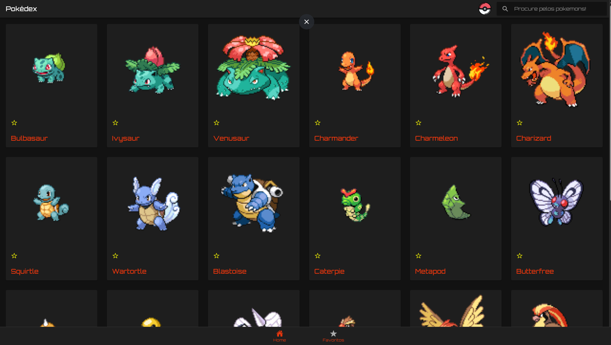
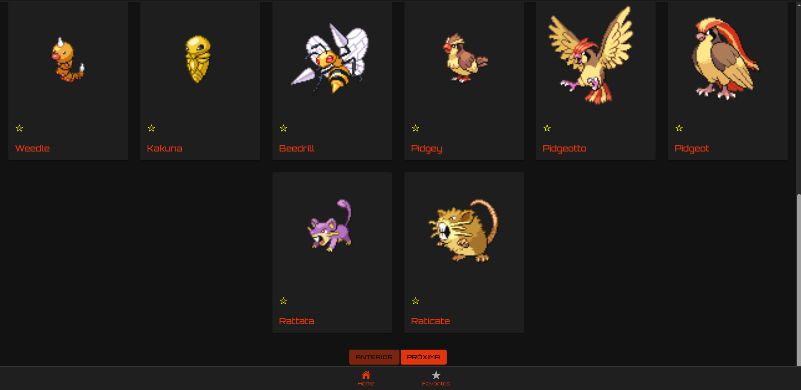
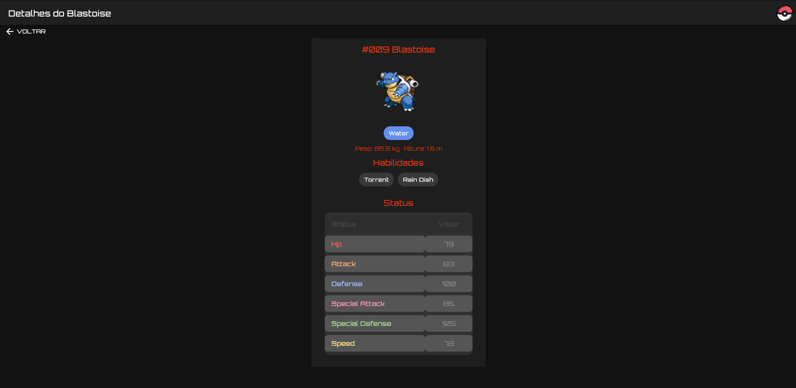
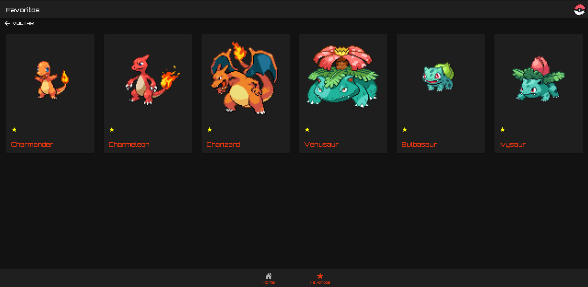
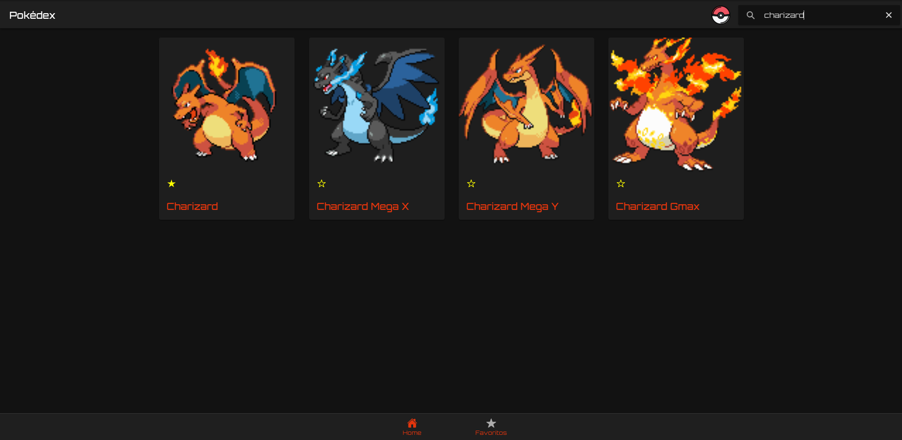
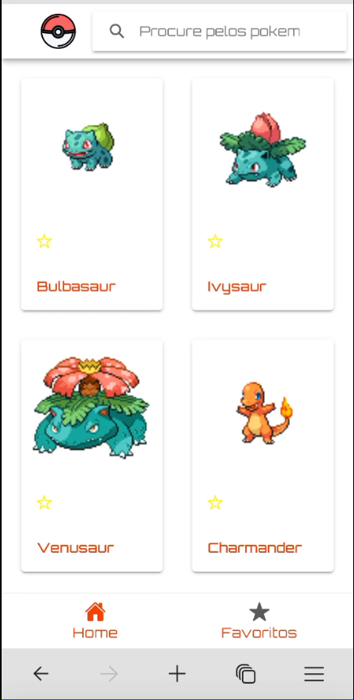
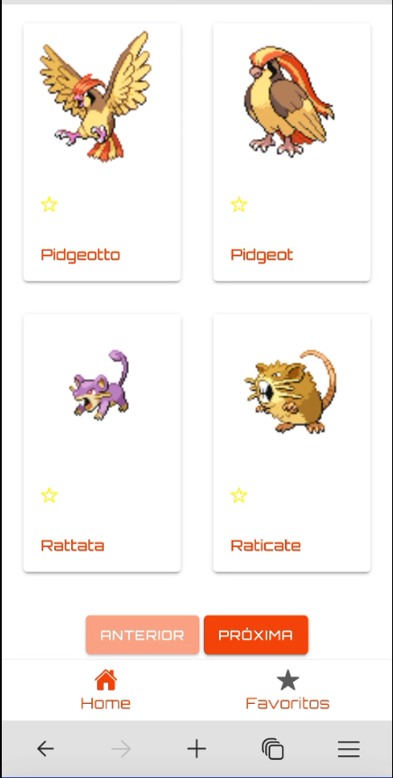
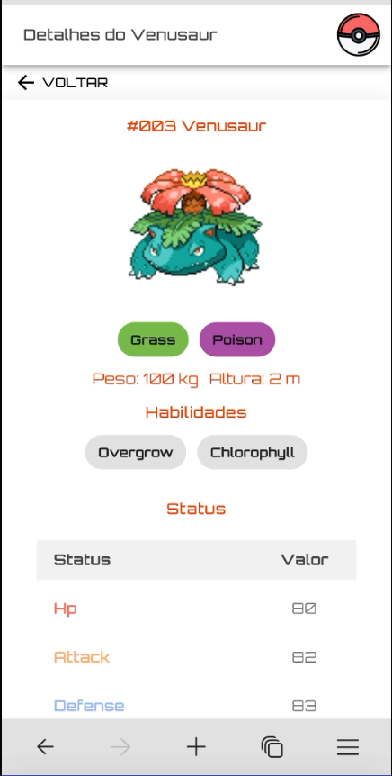
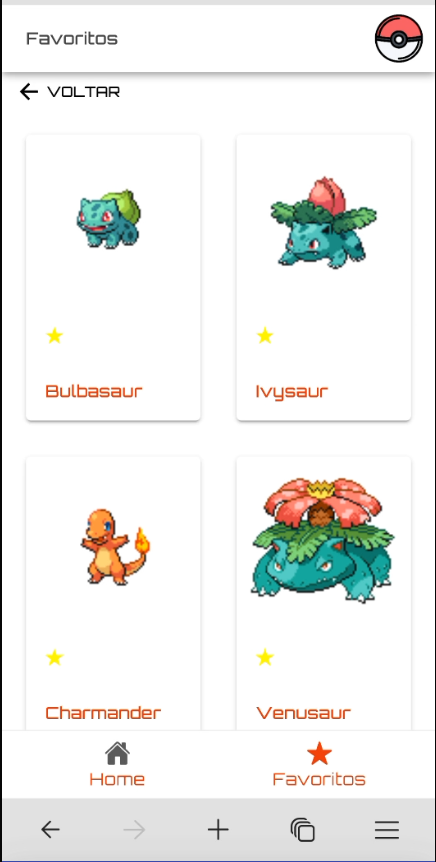
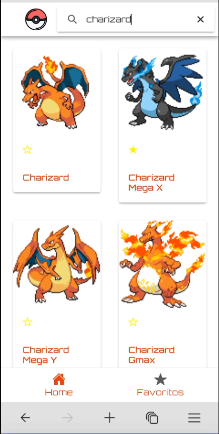

# Pokédex Angular + Ionic

Uma Pokédex moderna desenvolvida com Angular e Ionic, oferecendo uma interface responsiva e intuitiva para explorar o mundo Pokémon!

## 🎯 Abordagem Técnica

### Padrões de Design
- **Component-Based Architecture**: Estrutura modular com componentes reutilizáveis e independentes
- **Reactive Programming**: Uso extensivo de Observables (RxJS) para gerenciamento de estado e eventos
- **Service Layer Pattern**: Separação clara entre lógica de negócios (services) e apresentação (components)
- **Singleton Services**: Serviços globais para gerenciamento de estado e cache

### Estilo de Codificação
- **Clean Code**: Nomes descritivos, funções pequenas e focadas, responsabilidade única
- **TypeScript Strict Mode**: Uso completo do sistema de tipos do TypeScript
- **Async/Await**: Tratamento consistente de operações assíncronas
- **SOLID Principles**: 
  - Single Responsibility (componentes e serviços focados)
  - Open/Closed (extensibilidade via interfaces)
  - Interface Segregation (interfaces específicas para tipos)
  - Dependency Injection (injeção via constructors)

### Principais Decisões Técnicas
- **Cache Strategy**: Implementação de cache local para melhor performance e UX
- **Debounce Search**: Otimização de chamadas de busca com debounce de 1000ms
- **Responsive Design**: Layout adaptativo usando Ionic Grid System
- **Error Handling**: Tratamento gracioso de erros e estados vazios
- **State Management**: Gerenciamento local de estado via services e observables

### Convenções de Código
```typescript
// Nomeação clara e descritiva
interface Pokemon {
  name: string;
  types: PokemonType[];
}

// Serviços com responsabilidade única
@Injectable({
  providedIn: 'root'
})
export class PokemonService {
  private cache = new Map<string, Pokemon>();
}

// Componentes com props tipadas
@Component({
  selector: 'app-pokemon-card',
})
export class PokemonCardComponent {
  @Input() pokemon!: Pokemon;
}
```

## ✨ Funcionalidades

- 📱 Interface responsiva para mobile e desktop
- 🔍 Busca de Pokémon por nome
- ⭐ Sistema de favoritos
- 📊 Visualização detalhada de status
- 🎨 Cores dinâmicas baseadas no tipo do Pokémon
- 📱 Paginação para navegar entre Pokémon
- 💾 Cache local para melhor performance

## 🚀 Tecnologias

- [Angular](https://angular.io/)
- [Ionic Framework](https://ionicframework.com/)
- [PokeAPI](https://pokeapi.co/)
- TypeScript
- SCSS

## 📦 Pré-requisitos

- Node.js (versão 14 ou superior)
- npm ou yarn
- Angular CLI
- Ionic CLI

## 🔧 Instalação

1. Clone o repositório:
```bash
git clone https://seu-repositorio/pokedex.git
cd pokedex
```

2. Instale as dependências:
```bash
npm install
```

3. Execute o projeto:
```bash
ionic serve
```

O aplicativo estará disponível em `http://localhost:8100/`

## 🏗️ Estrutura do Projeto

```
src/
├── app/
│   ├── components/         # Componentes reutilizáveis
│   ├── services/          # Serviços de dados
│   ├── home/             # Página principal
│   └── types/            # Tipos e interfaces
├── assets/               # Recursos estáticos
└── theme/               # Estilos globais
```

## 🎨 Personalização

O projeto utiliza variáveis SCSS para temas, que podem ser encontradas em:
- `src/theme/variables.scss`
- `src/global.scss`

## 📱 Recursos da Interface

- **Lista de Pokémon**: Visualização em grid com cards

    - 
    - 

- **Detalhes**: Página dedicada com informações detalhadas

    - 

- **Favoritos**: Sistema de gerenciamento de favoritos

    - 

- **Busca**: Pesquisa em tempo real com debounce

    - 

- **Responsividade**: Layout adaptativo para diferentes tamanhos de tela

    - 
    - 
    - 
    - 
    - 

Espero que gostem!